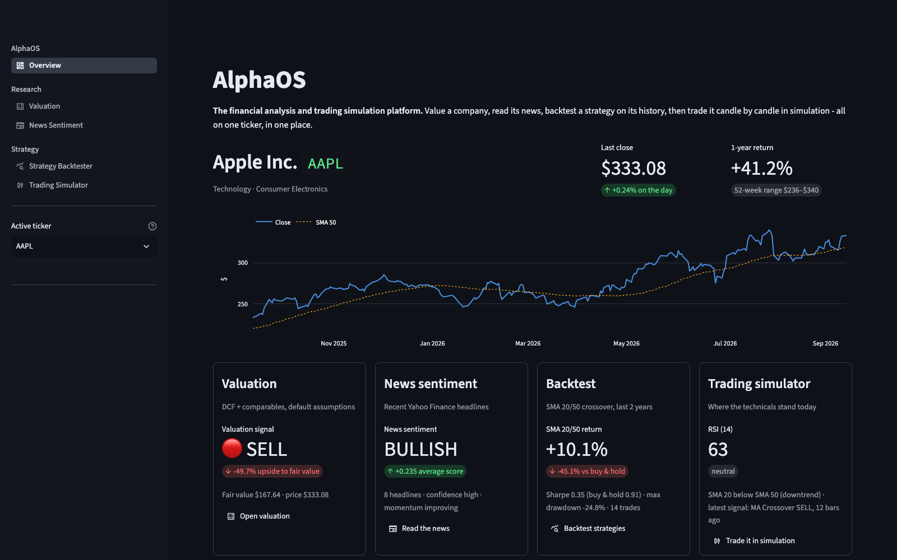

# AlphaOS

**The financial analysis and trading simulation platform.** Pick a ticker, then
work it end to end in one app:

- **Value it.** DCF and comparable multiples, blended into a BUY / HOLD / SELL call
  with a margin of safety.
- **Read the news.** Recent headlines scored with a finance-tuned sentiment
  lexicon, with tone, momentum and confidence.
- **Backtest strategies.** SMA crossover, RSI, MACD, moving-average crossover,
  Fair Value Gap and liquidity-sweep strategies on years of history, against buy
  and hold, with parameter sweeps.
- **Trade it in simulation.** Replay real market data candle by candle, paper
  trade long and short, run strategies automatically, or practise in Learning
  Mode.

The active ticker follows you across every tool, and the overview shows all four
views of it at once. When a backtest looks promising, one click replays the same
strategy in the trading simulator.



## Quick start

AlphaOS is this repository plus four tool repositories that live inside it:

```bash
git clone https://github.com/akshat12kapoor-rgb/AlphaLens.git
cd AlphaLens
git clone https://github.com/akshat12kapoor-rgb/stock-valuation-dashboard.git
git clone https://github.com/akshat12kapoor-rgb/SentimentFinance.git
git clone https://github.com/akshat12kapoor-rgb/AlgoBacktester.git
git clone https://github.com/akshat12kapoor-rgb/TradingSimTALP.git stock_simulator
```

Install and run:

```bash
python3 -m venv .venv
.venv/bin/pip install -r requirements.txt
.venv/bin/streamlit run app.py
```

Open http://localhost:8501. The first time you run Streamlit, the terminal asks
for an email address; press Enter to skip.

## The tools

| Tool | What you get | Built on |
|---|---|---|
| Overview | Price, 52-week range and a card from every tool for the active ticker | all of the below |
| Valuation | Single-, two- or three-stage DCF, sector P/E and EV/EBITDA comps, sensitivity heatmap, BUY/HOLD/SELL | [stock-valuation-dashboard](https://github.com/akshat12kapoor-rgb/stock-valuation-dashboard) |
| News Sentiment | Live Yahoo Finance headlines scored per ticker; score your own headline or feed file | [SentimentFinance](https://github.com/akshat12kapoor-rgb/SentimentFinance) |
| Strategy Backtester | Equity curve and drawdown vs buy and hold, trade markers, SMA parameter sweep, CSV upload | [AlgoBacktester](https://github.com/akshat12kapoor-rgb/AlgoBacktester) |
| Trading Simulator | Candle replay, manual or automatic long/short paper trading, FVG and sweep detection, Learning Mode | [TradingSimTALP](https://github.com/akshat12kapoor-rgb/TradingSimTALP) |

Each tool also still runs on its own from its own directory.

## How backtests are kept honest

- A signal decided on one bar's close is traded over the next bar's return.
- None of the strategies use future bars.
- Costs are charged whenever the position changes.
- Sweep results are in-sample: the best cell is the one most fitted to that
  history, so check it on another period or ticker before trusting it.

## Notes

- Market data and news come from Yahoo Finance and can be delayed or
  rate-limited.
- Valuation needs company financial statements, so it isn't available for
  crypto or most ETFs; the other tools still work for those symbols.
- The simulator shows every price in ₹ and the valuation tool in $, whatever the
  ticker's actual currency.

AlphaOS is for research, learning and simulation. It places no real trades and
is not financial advice.
