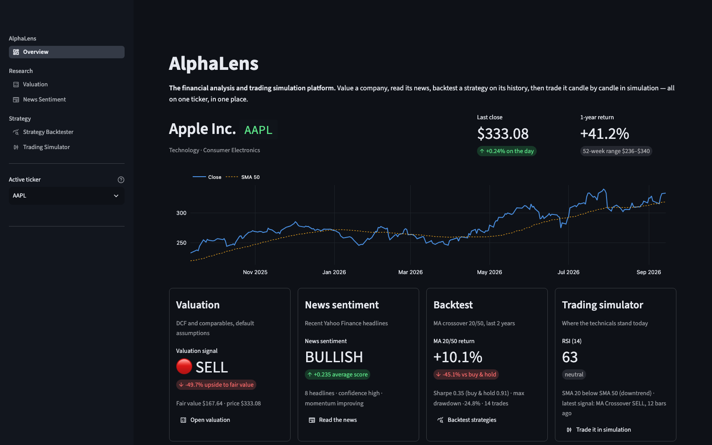

# AlphaLens

**A financial analysis and trading simulation platform.** Pick a ticker, then work it
end to end in one app:

- **Value it.** Discounted cash flow and comparable multiples, blended into a
  BUY / HOLD / SELL call with a margin of safety, plus a sensitivity grid.
- **Read the news.** Recent headlines scored with a finance-tuned lexicon: tone,
  momentum, confidence, and the exact words behind each score.
- **Backtest strategies.** Moving-average crossover, RSI, MACD, Fair Value Gap
  and liquidity-sweep strategies over years of history, against buy and hold,
  with parameter sweeps.
- **Trade it in simulation.** Replay real market data candle by candle, paper
  trade long and short, auto-trade a strategy, or practise in Learning Mode.

The active ticker follows you across every tool, the overview shows all four
views of it at once, and a promising backtest replays in the simulator in one
click. Prices are shown in the instrument's own currency.



## Quick start

```bash
git clone https://github.com/akshat12kapoor-rgb/AlphaLens.git
cd AlphaLens
python3 -m venv .venv
.venv/bin/pip install -r requirements.txt
.venv/bin/streamlit run app.py
```

Open http://localhost:8501. The first time you run Streamlit it asks for an
email address in the terminal; press Enter to skip.

## Command line

Both tools also run without the app, on the bundled sample data or live prices:

```bash
.venv/bin/python -m alphalens.backtest --symbol AAPL --strategy macd --period 5y
.venv/bin/python -m alphalens.sentiment --live AAPL
.venv/bin/python -m alphalens.sentiment --text "Nvidia beats estimates but warns of weak demand"
```

## Layout

```
app.py                  Streamlit entry: navigation and the shared ticker
views/                  one thin script per page
alphalens/
  core/                 configuration, currency formatting
  data/                 Yahoo Finance access, CSV loading, models, fixtures
  signals/              indicators, smart-money detection, the strategy catalogue
  backtest/             engine, parameter sweeps, CLI
  trading/              paper-trading engine, performance statistics
  valuation/            DCF, comparables, verdict
  sentiment/            lexicon, feed parsing, scoring, CLI
  charts/               Plotly builders and one shared theme
  ui/                   pages, replay loop, shared widgets
tests/                  pytest suite
fixtures/               committed snapshots for offline runs
```

A strategy is defined once, in `alphalens/signals/strategies.py`, and both the
backtester and the simulator use it: the backtester asks for a position per bar,
the simulator for buy and sell events, and whichever form a strategy doesn't
define natively is derived.

## Tests

```bash
.venv/bin/pip install -r requirements-dev.txt
.venv/bin/python -m pytest tests -q
```

The suite covers the maths that matters: currency formatting, indicators, gap and
sweep detection, the strategy catalogue (including a check that no strategy can
see future bars), the backtest engine against known figures, the paper-trading
engine, valuation, and sentiment scoring.

## How backtests are kept honest

- A signal decided on one bar's close is traded over the next bar's return.
- No strategy reads future bars; a test asserts this for every one of them.
- Costs are charged whenever the position changes.
- Sweep results are in-sample: the best cell is the one most fitted to that
  history, so check it on another period or ticker before trusting it.

## Notes

- Market data and news come from Yahoo Finance and can be delayed or
  rate-limited.
- Valuation needs published financial statements, so it isn't available for
  crypto and most ETFs; the other tools still work for those symbols.
- The simulator's shorting is collateralised with cash at 100%, which is simpler
  than a real broker's margin rules.

AlphaLens is for research, learning and simulation. It places no real trades and is
not financial advice.
